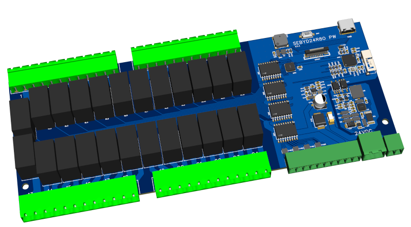
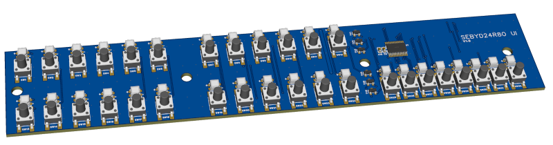

# SebyD24R8O – Open Source Home Automation Device

The board features 24 relay outputs with a normally open contact and a capacity of 8A, and 8 open-collector outputs where you can activate relays with higher capacity or different contact configurations, for a total of 32 output channels. The device connects to the SCS bus of the BTicino myhome system. Each channel can be configured in the following ways:
- Light point
- Shutters (2 channels required for each address, up/down)
- Valve and pump activation on the thermal system

## ✨ Features
- DIN 12 module case
- 24 relay actuators
- 8 open collector outputs up to 500mA and 50V
- Each channel can be configured as: Light/switch, Shutters (2 channels are required), Thermal system as an actuator for the zone or pump
- Channel button with status indication LED
- No external software required for setup
- Web-based configuration via internal Wi-Fi server
- Websocket channel to monitor bus frame traffic
- Requires external 24V 1A power supply 
- OTA firmware updates supported
- Opto-isolated bus interface
---

## ⚙️ Hardware Overview
- **MCU:** ESP32-S3FH4R2 SoC
    - 4MB Flash
    - Integrated Wi-Fi for setup and OTA updates
    - Peripherals: UART, IRDA, RMT, etc.
- **Bus Interface:** STKNX chip
    - Handles bus communication
    - Optoisolated

---

## 🛠️ Setup & Configuration

## Setup WEB Page
to enable wifi AP press 25 and 32 channel buttons (channel 32 LED will change color).
After connected to wifi AP the setup page is available at local address http://192.168.4.1. The websocket is available at address: ws://192.168.4.1/ws

---

## 🔗 Communication
- **Web page**: Full configuration channels setup / OTA Update
- **Websocket channel**: Live monitoring of bus traffic

---

## 📥 Firmware
- Latest firmware releases available under firmware folder
- Flash via **OTA update** or **USB (UART)**  

**This project is for educational purposes only and does not imply any acceptance of responsibility beyond its intended use**